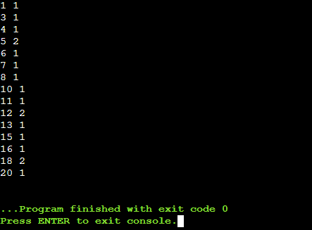

## ЛАБОРАТОРНАЯ РАБОТА 2
### ЗАДАНИЕ:
По данной последовательности целых чисел постройте бинарное 
дерево поиска, запоминая для каждого элемента последовательности его 
значение и количество его повторений.
Входные данные
Вводится последовательность целых чисел.
Выходные данные
Выведите на экран содержимое дерева в порядке возрастания, по одному 
элементу на строку. В каждой строке выводите значение элемента, затем, 
через пробел, укажите, сколько раз он встречается в исходной 
последовательности.
Пример
Входные данные
7 3 7 2 1 9 5 4 6 8 8
Выходные данные
1 1
2 1
3 1
4 1
5 1
6 1
7 2
8 2
9 1

### КОД:

ВХОДНЫЕ ДАННЫЕ ВОЗЬМЕМ ТАКИЕ: 10, 5, 15, 3, 7, 12, 18, 1, 4, 6, 8, 11, 13, 16, 20, 5, 12, 18

```C
#include <stdio.h>
#include <stdlib.h>

struct Node {
    int value;
    int count;
    struct Node* left;
    struct Node* right;
};

struct Node* createNode(int value) {
    struct Node* newNode = (struct Node*)malloc(sizeof(struct Node));
    newNode->value = value;
    newNode->count = 1;
    newNode->left = NULL;
    newNode->right = NULL;
    return newNode;
}

struct Node* insert(struct Node* root, int value) {
    if (root == NULL) {
        return createNode(value);
    }
    
    if (value < root->value) {
        root->left = insert(root->left, value);
    } else if (value > root->value) {
        root->right = insert(root->right, value);
    } else {
        root->count++;
    }
    
    return root;
}

void inorderTraversal(struct Node* root) {
    if (root != NULL) {
        inorderTraversal(root->left);
        printf("%d %d\n", root->value, root->count);
        inorderTraversal(root->right);
    }
}

void freeTree(struct Node* root) {
    if (root != NULL) {
        freeTree(root->left);
        freeTree(root->right);
        free(root);
    }
}

int main() {
    struct Node* root = NULL;
    int input[] = {10, 5, 15, 3, 7, 12, 18, 1, 4, 6, 8, 11, 13, 16, 20, 5, 12, 18};
    int size = sizeof(input) / sizeof(input[0]);

    for (int i = 0; i < size; i++) {
        root = insert(root, input[i]);
    }

    inorderTraversal(root);
    freeTree(root);

    return 0;
}
```

### РЕЗУЛЬТАТ:

