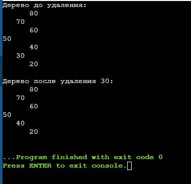

## ЛАБОРАТОРНАЯ РАБОТА 3
### ЗАДАНИЕ:
Реализовать операцию удаления узла из бинарного дерева поиска. Необходимо учесть три
 возможных случая:
 1. у удаляемого узла нет дочерних узлов,
 2. у удаляемого узла есть только один дочерний узел, 
3. у удаляемого узла два дочерних узла.
 После выполнеия операции удаления узла бинарное дерево поиска должно сохранить свое
 свойство: если x — узел бинарного дерева с ключом k, то все узлы в левом поддереве должны
 иметь ключи, меньшие k, а в правом поддереве большие k.

 ## Код
 ```c
 #include <stdio.h>
#include <stdlib.h>

// Структура узла дерева
struct Node {
    int value;
    struct Node* left;
    struct Node* right;
};

// Создание нового узла
struct Node* createNode(int value) {
    struct Node* newNode = (struct Node*)malloc(sizeof(struct Node));
    newNode->value = value;
    newNode->left = NULL;
    newNode->right = NULL;
    return newNode;
}

// функция печати дерева
void printTree(struct Node* root, int level) {
    if (root == NULL) return;
    
    // Печатаем правое поддерево
    printTree(root->right, level + 1);
    
    // Печатаем текущий узел
    for(int i = 0; i < level; i++) {
        printf("   ");
    }
    printf("%d\n", root->value);
    
    // Печатаем левое поддерево
    printTree(root->left, level + 1);
}

// Поиск минимального значения в дереве
struct Node* findMin(struct Node* node) {
    while (node->left != NULL) {
        node = node->left;
    }
    return node;
}

// Удаление узла
struct Node* deleteNode(struct Node* root, int key) {
    if (root == NULL) return root;

    if (key < root->value)
        root->left = deleteNode(root->left, key);
    else if (key > root->value)
        root->right = deleteNode(root->right, key);
    else {
        
        if (root->left == NULL) {
            struct Node* temp = root->right;
            free(root);
            return temp;
        }
        else if (root->right == NULL) {
            struct Node* temp = root->left;
            free(root);
            return temp;
        }
        
        struct Node* temp = findMin(root->right);
        root->value = temp->value;
        root->right = deleteNode(root->right, temp->value);
    }
    return root;
}

int main() {
    // Создаем тестовое дерево
    struct Node* root = createNode(50);
    root->left = createNode(30);
    root->right = createNode(70);
    root->left->left = createNode(20);
    root->left->right = createNode(40);
    root->right->left = createNode(60);
    root->right->right = createNode(80);

    printf("Дерево до удаления:\n");
    printTree(root, 0);

    // Удаляем узел (например, 30)
    root = deleteNode(root, 30);

    printf("\nДерево после удаления 30:\n");
    printTree(root, 0);

    return 0;
}
 ```

 ## Результат
 
