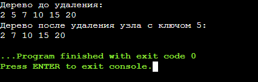

## ЛАБОРАТОРНАЯ РАБОТА 3
### ЗАДАНИЕ:
Реализовать операцию удаления узла из бинарного дерева поиска. Необходимо учесть три
 возможных случая:
 1. у удаляемого узла нет дочерних узлов,
 2. у удаляемого узла есть только один дочерний узел, 
3. у удаляемого узла два дочерних узла.
 После выполнеия операции удаления узла бинарное дерево поиска должно сохранить свое
 свойство: если x — узел бинарного дерева с ключом k, то все узлы в левом поддереве должны
 иметь ключи, меньшие k, а в правом поддереве большие k.

 ## Код
 ```c
 #include <stdio.h>
#include <stdlib.h>

// Структура узла
struct Node {
    int value;
    struct Node* left;
    struct Node* right;
};

// Создание нового узла
struct Node* createNode(int value) {
    struct Node* newNode = (struct Node*)malloc(sizeof(struct Node));
    newNode->value = value;
    newNode->left = NULL;
    newNode->right = NULL;
    return newNode;
}

// Найти минимальный узел в поддереве
struct Node* findMin(struct Node* node) {
    while (node->left != NULL) {
        node = node->left;
    }
    return node;
}

// Удаление узла
struct Node* deleteNode(struct Node* root, int key) {
    if (root == NULL) return root; // Дерево пусто

    // Ищем узел, который нужно удалить
    if (key < root->value) {
        root->left = deleteNode(root->left, key);
    } else if (key > root->value) {
        root->right = deleteNode(root->right, key);
    } else {
        // Удаляем узел

        // 1. У узла нет дочерних узлов
        if (root->left == NULL && root->right == NULL) {
            free(root); // Освобождаем память
            return NULL; // Удаляем узел
        }
        
        // 2. У узла только один дочерний узел
        else if (root->left == NULL) {
            struct Node* temp = root->right; // Сохраняем правого ребенка
            free(root); // Освобождаем память
            return temp; 
        } else if (root->right == NULL) {
            struct Node* temp = root->left; // Сохраняем левого ребенка
            free(root); // Освобождаем память
            return temp; 
        }

        // 3. У узла два дочерних узла
        else {
            // Находим минимальный узел в правом поддереве
            struct Node* temp = findMin(root->right);
            root->value = temp->value; // Копируем значение
            root->right = deleteNode(root->right, temp->value); // Удаляем минимальный узел
        }
    }
    return root; // Возвращаем корень дерева
}

// Печать дерева ин-ордер
void printInOrder(struct Node* root) {
    if (root != NULL) {
        printInOrder(root->left);
        printf("%d ", root->value);
        printInOrder(root->right);
    }
}

// Основная функция
int main() {
    // Создаем бинарное дерево поиска
    struct Node* root = createNode(10);
    root->left = createNode(5);
    root->right = createNode(15);
    root->left->left = createNode(2);
    root->left->right = createNode(7);
    root->right->right = createNode(20);

    printf("Дерево до удаления:\n");
    printInOrder(root); // Печатаем дерево до удаления

    // Удаляем узел с ключом 5
    root = deleteNode(root, 5);
    printf("\nДерево после удаления узла с ключом 5:\n");
    printInOrder(root); // Печатаем дерево после удаления

    return 0;
}
 ```

 ## Результат
 